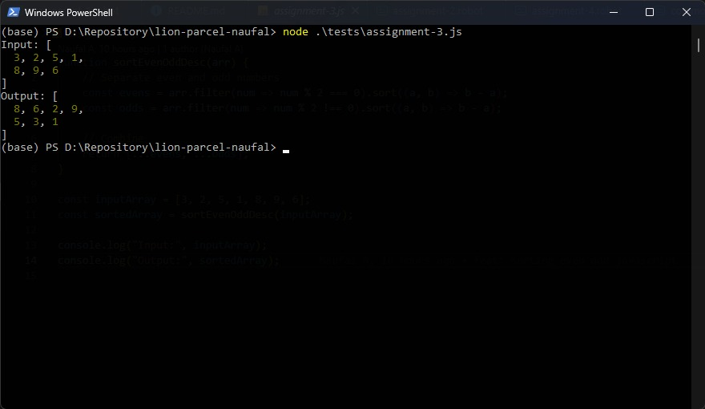
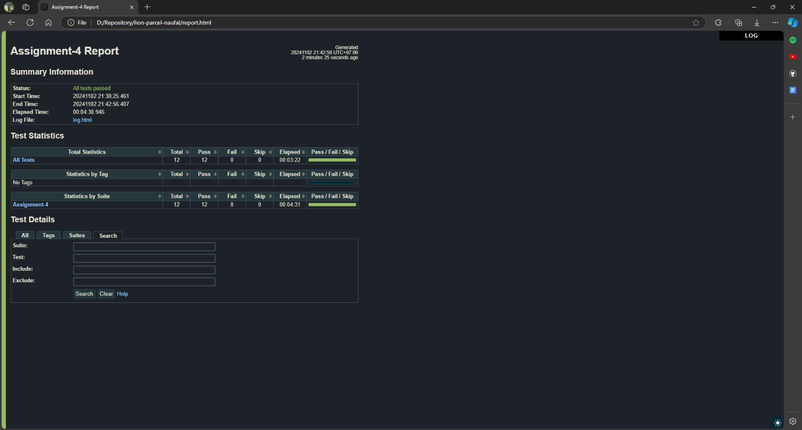
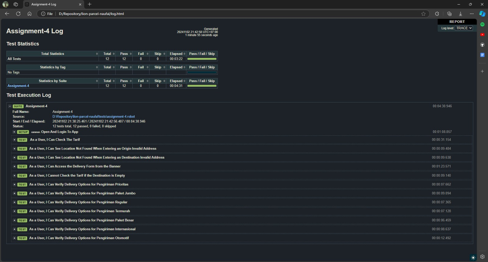

## Assignment 1: API Automation Testing

This Robot Framework script tests the [Reqres API](https://reqres.in/) for:
- **GET SINGLE USER**: Retrieves user with ID 2, checks for status `200`, and validates against `single-user.json`.
- **POST CREATE USER**: Creates a user with name "morpheus" and job "leader", checks for status `201`, and validates against `create-user.json`.

### Structure
- **Test Cases**:
  - `Get Single User`
  - `Create New User`
- **Schemas**: Located in the `schemas` folder.

### Run the Test
```bash
robot tests/assignment-1.robot
```

## Assignment 2: Shopping Cart Checkout Automation

This Robot Framework script automates the user journey on [Sauce Demo](https://www.saucedemo.com/) for a complete checkout process:
- **Login**: Logs in as a standard user.
- **Add Product**: Adds "Sauce Labs Backpack" to the cart.
- **Checkout**: Proceeds through the checkout process, fills in user details, and completes the order.
- **Validation**: Verifies the order confirmation message.

### Structure
- **Test Case**: 
  - `As a User, I Can Successfully Purchase a Product`

### Run the Test
```bash
robot tests/assignment-2.robot
```

### Test Plan & Test Case Documentation
Create Test Plan & Test Case for journey as a buyer:
[Google Sheets Test Plan](https://docs.google.com/spreadsheets/d/11UpwLe6yNgsfwj9JxhTDh7wP8PRnRUei/edit?usp=sharing&ouid=118163462700119744611&rtpof=true&sd=true)

## Assignment 3: Sorting Even and Odd Numbers in Descending Order

This JavaScript function sorts an array of integers by separating even and odd numbers, sorting each group in descending order, and then combining them with even numbers first. 

### Code
```javascript
function sortEvenOddDesc(arr) {
    // Separate even and odd numbers
    const evens = arr.filter(num => num % 2 === 0).sort((a, b) => b - a);
    const odds = arr.filter(num => num % 2 !== 0).sort((a, b) => b - a);

    // Combine
    return [...evens, ...odds];
}

const inputArray = [3, 2, 5, 1, 8, 9, 6];
const sortedArray = sortEvenOddDesc(inputArray);

console.log("Input:", inputArray);
console.log("Output:", sortedArray);
```

### Output Screenshot


### Run the Code

```bash
node tests/assignment-3.js
```

## Assignment 4: Mobile Automation Testing for Lion Parcel

This Robot Framework script automates positive and negative scenarios for the "Cek Tarif" feature in the Lion Parcel app. It includes checking valid and invalid addresses, verifying delivery options for different shipment types, and validating interface responses.

### Structure
- **Positive Scenarios**: 
  - Checking the tarif from valid addresses.
  - Accessing the delivery form.
  - Verifying available delivery options.
- **Negative Scenarios**: 
  - Handling invalid origin and destination addresses.
  - Validating that tarif calculation is not possible without a destination.

### Run the Test
```bash
robot tests/assignment-4.robot
```

### Video Demonstration
Watch the video of the test execution [here](https://drive.google.com/file/d/1CRlqHjAV2oUGVHS3dnD5If7Zm2i4KzRp/view?usp=sharing).

### Screenshot Result


### Screenshot Log


### FYI

- **Coachmark Delay Issue**: Another challenge observed was with the delay in closing the coachmark. This issue has been encountered before, where Appium's logs indicate prolonged time in locating and clicking the coachmark element. This delay appears to be due to the interactive package used for the coachmark, causing slower response times in interactions.